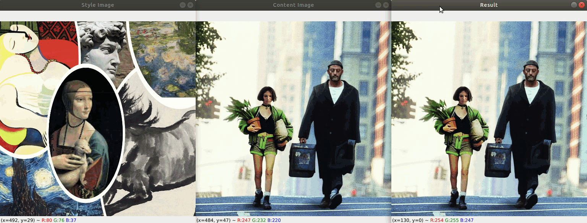
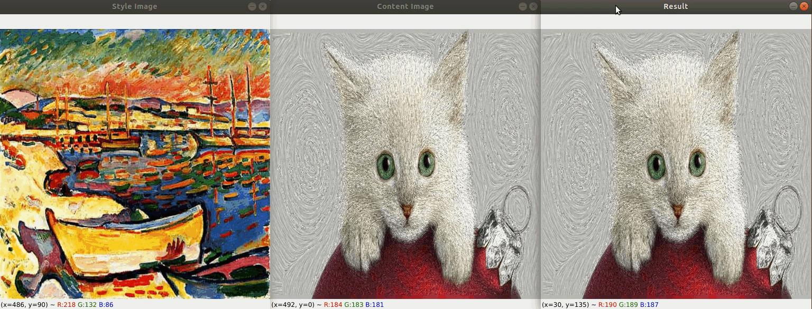
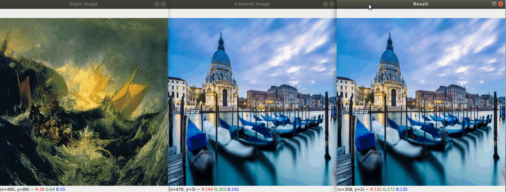

<!-- # Transfer-Any-Style -->

We plan to create a very interesting demo by combining [Segment Anything](https://github.com/facebookresearch/segment-anything) and a series of style transfer models! We will continue to improve it and create more interesting demos. **Interesting ideas, results, and contributions are warmly welcome!**

[[Arxiv]](https://arxiv.org/abs/2304.09728)

## Demo
- Different contents can specify different styles in a style image. Left click to select an area and right click to exclude an area.

  

- Middle click and drag your mouse to specify a bounding box.

  

- You can also draw a contour with mouse and specify a style region for it.

  

## Installation
```shell
python -m pip install torch
python -m pip install -e segment_anything
python -m pip install opencv-python
```

- The code is tested on the environment with Ubuntu 18.04, python 3.6.9, torch 1.8.1+cuda10.2, opencv-python 4.5.5, and a 2080Ti GPU.

## Get Started

* Clone this repo:

  ```shell
  git clone https://github.com/Huage001/Transfer-Any-Style.git
  cd Transfer-Any-Style
  ```

* Download the model checkpoint of Segment Anything:

  ```shell
  wget https://dl.fbaipublicfiles.com/segment_anything/sam_vit_h_4b8939.pth
  mv sam_vit_h_4b8939.pth segment-anything/
  ```

* Download the model checkpoint of AdaAttN from [here](https://drive.google.com/file/d/1Lnl_1vWfCvF7ZzmWwkHZG4SexjaXuUc5/view?usp=sharing) and unzip it to directory of this repo:

  ```shell
  mv [DOWNLOAD_PATH]/ckpt.zip .
  unzip ckpt.zip
  rm ckpt.zip
  ```

* Run the following command:

  ```shell
  python transfer_any_style.py \
  --content_path CONTENT_PATH \
  --style_path STYLE_PATH \
  --resize
  ```
  
  Follow the instruction printed on the console to run the interactive demo.

* Full usage:

  * Command: *python transfer_any_style.py [-h] --content_path CONTENT_PATH --style_path STYLE_PATH [--output_dir OUTPUT_DIR] [--resize] [--keep_ratio]*

  * Arguments:
    * --content_path: Path to a single content img
    * --style_path: Path to a single style img
    * --output_dir: Output path
    * --resize: Whether resize images to the 512 scale, which is the training resolution of the model and may yield better performance
    * --keep_ratio: Whether keep the aspect ratio of original images while resizing

## Future Work

* Support more style images at a time.
* Integrate with more state-of-the-art style transfer methods.

* More user-friendly and stable user interface.
* ...

## :cupid: Acknowledgement
- [Segment Anything](https://github.com/facebookresearch/segment-anything)
- [AdaAttN](https://github.com/Huage001/AdaAttN)
- [Inpaint-Anything](https://github.com/geekyutao/Inpaint-Anything)
- [Anything-3D](https://github.com/Anything-of-anything/Anything-3D)

## Citation
If you find this project helpful for your research, please consider citing the following BibTeX entry.
```BibTex

@article{liu2023any,
  title={Any-to-Any Style Transfer},
  author={Liu, Songhua and Ye, Jingwen and Wang, Xinchao},
  journal={arXiv preprint arXiv:2304.09728},
  year={2023}
}

@article{kirillov2023segany,
    title={Segment Anything}, 
    author={Kirillov, Alexander and Mintun, Eric and Ravi, Nikhila and Mao, Hanzi and Rolland, Chloe and Gustafson, Laura and Xiao, Tete and Whitehead, Spencer and Berg, Alexander C. and Lo, Wan-Yen and Doll{\'a}r, Piotr and Girshick, Ross},
    journal={arXiv:2304.02643},
    year={2023}
}

@inproceedings{liu2021adaattn,
  title={AdaAttN: Revisit Attention Mechanism in Arbitrary Neural Style Transfer},
  author={Liu, Songhua and Lin, Tianwei and He, Dongliang and Li, Fu and Wang, Meiling and Li, Xin and Sun, Zhengxing and Li, Qian and Ding, Errui},
  booktitle={Proceedings of the IEEE International Conference on Computer Vision},
  year={2021}
}

@article{yu2023inpaint,
  title={Inpaint Anything: Segment Anything Meets Image Inpainting},
  author={Yu, Tao and Feng, Runseng and Feng, Ruoyu and Liu, Jinming and Jin, Xin and Zeng, Wenjun and Chen, Zhibo},
  journal={arXiv preprint arXiv:2304.06790},
  year={2023}
}
```
